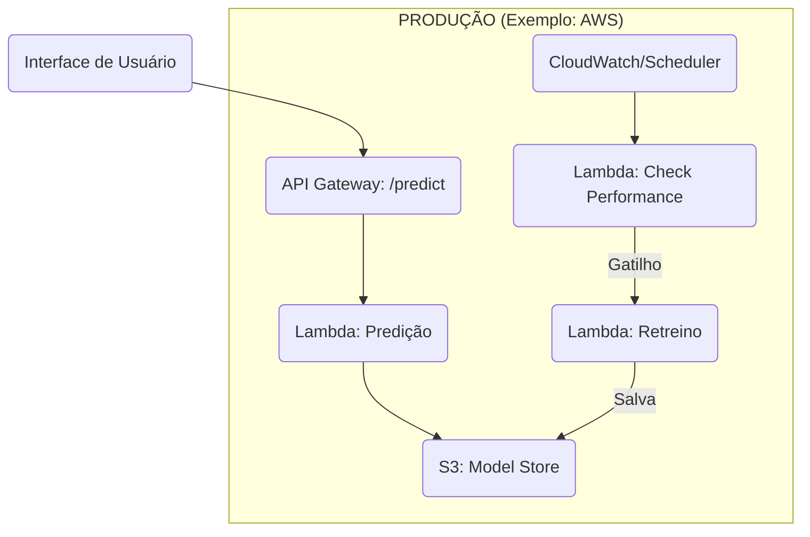

# Desafio de Data Science: Previsão de Preços (MLOps Simulado)

Este repositório contém a solução completa para o "Desafio de Data Science — Previsão de Preços de Casas". O foco é demonstrar um pipeline de ponta a ponta, desde a análise de dados robusta até uma **simulação de deploy e aprendizado contínuo** (MLOps) com uma API interativa.

**Diferencial do Projeto:** O modelo usa um **gatilho inteligente** de retreino, que verifica a performance real dos novos dados antes de acionar o treinamento, garantindo estabilidade e eficiência.

-----

## Respostas aos Entregáveis do Desafio

Aqui estão as respostas diretas aos 5 entregáveis solicitados, com referências aos arquivos correspondentes no repositório.

### 1\. Análise e entendimento dos dados

A análise exploratória completa, incluindo a explicação de variáveis, tratamento de outliers, correlações e a metodologia de combinação dos dados físicos e demográficos, está detalhada em dois locais:

1.  **Relatório Técnico:** Veja o arquivo `docs/reports/technical_report.md` para uma análise e explicação consolidadas.
2.  **Notebooks (Jupyter):** Para a análise interativa e o código-fonte, consulte `notebooks/01_ead.ipynb` e `notebooks/02_feature_engeneering.ipynb`.

### 2\. Desenvolvimento do modelo de Machine Learning

Todo o processo de modelagem, seleção de features e validação está documentado nos seguintes arquivos:

  * **a. Variáveis importantes:** A análise de relevância das features (incluindo gráficos SHAP,) está no Relatório Técnico (`docs/reports/technical_report.md`) e no notebook `notebooks/03_modeling_and_evaluation.ipynb`.
  * **b. Escolha do modelo:** A justificativa para a escolha do **LightGBM (LGBM)**, comparado a outros modelos, está no Relatório Técnico e no notebook de modelagem.
  * **c. Generalização:** A estratégia de generalização (uso de *train/test split* e *cross-validation*) está documentada no notebook `notebooks/03_modeling_and_evaluation.ipynb` e implementada de forma robusta no script `src/models/train_model.py`.

### 3\. Estratégia de Deploy

O deploy é demonstrado através da simulação local (`api.py` e `index.html`). Uma arquitetura de produção escalável seguiria o seguinte diagrama lógico, que a simulação replica em funcionalidade:



  * **API (API Gateway):** Recebe requisições `/predict` e `/feedback`.
  * **Computação (Lambda/ECS):** Funções *serverless* (Lambda) ou containers (ECS/Fargate) para executar a predição (carregando o modelo do S3) e acionar o retreino.
  * **Armazenamento (S3/Model Store):** S3 para armazenar os artefatos do modelo (`model.joblib`) e métricas.
  * **Monitoramento (CloudWatch):** Agendador (Scheduler) para disparar a verificação de performance e logs.

### 4\. Aprendizado Contínuo

O ciclo de aprendizado contínuo é demonstrado pelo **"Gatilho Inteligente"** na simulação (`api.py`):

1.  **Monitoramento:** A cada 60s, o *endpoint* `/check-performance` (simulando um *cronjob*) calcula o **Erro Percentual (MAPE)** dos novos dados de feedback coletados.
2.  **Decisão (Gatilho):** Se `MAPE > 15%` (o limite definido), o modelo é considerado obsoleto (*model drift*) e o retreino é acionado.
3.  **Recarga (Hot-Swap):** O script `src/models/train_model.py` é executado, e o novo modelo é carregado pela API **sem downtime**.

#### Diferenças da Simulação vs. Deploy Real

A simulação atual é uma **demonstração local**. Em um ambiente de produção real:

  * **Gatilho:** O `/check-performance` não seria um endpoint público, mas sim um **job agendado** (ex: CloudWatch Event, Airflow DAG) executado em uma infraestrutura separada (ex: Lambda, ECS Task).
  * **Coleta de Feedback:** Os dados de feedback não seriam salvos em arquivos JSON locais (`data/feedback_local/`), mas sim em um **"Feedback Store"** robusto (ex: um Data Lake em S3 ou um banco de dados como DynamoDB).
  * **Treinamento:** O script de treino não rodaria no mesmo processo da API, mas sim em um **ambiente de treinamento dedicado** (ex: AWS SageMaker, ECS Task) que, ao finalizar, publicaria o novo modelo no "Model Store" (S3), acionando a atualização da API.

### 5\. Comunicação com Stakeholders

Para a comunicação com stakeholders de negócio, a abordagem focaria em traduzir as métricas técnicas em impacto de negócio.

A própria simulação (arquivo `index.html`) seria usada como **ferramenta de apresentação principal**. Durante a apresentação, eu a usaria para:

1.  **Demonstrar o Valor (Live Demo):** Fazer predições em tempo real para mostrar a funcionalidade.
2.  **Explicar Incerteza:** Apresentar a **"Margem de Confiança Dinâmica"** (calculada na `api.py`) e explicar o que ela significa para o negócio (ex: "em 95% das vezes, o preço real estará nesta faixa, o que nos ajuda a definir a oferta").
3.  **Descrever um Caso de Uso:** Enquadrar o modelo em um caso de uso específico. Por exemplo: "Podemos usar essa ferramenta para validar o preço de listagem de novos imóveis. Se o nosso modelo prevê um valor 15% acima do que o corretor sugere, isso dispara um alerta para revisão. Isso evita que deixemos de ganhar 15% ou que o imóvel fique 'encalhado' no mercado."

Esta abordagem focaria na interação e no impacto financeiro direto, sendo mais eficaz que um relatório estático.

-----

## Como Executar o Pipeline de Treinamento

O projeto é orquestrado por scripts Python. Certifique-se de que seus arquivos de dados (`kc_house_data.csv`, `zipcode_demographics.csv`) estão em `data/raw/` antes de começar.

### 1\. Instalação

```bash
# 1. Crie e ative um ambiente virtual
python -m venv .venv
source .venv/bin/activate  # ou .venv\Scripts\activate no Windows

# 2. Instale as dependências
pip install -r requirements.txt
```

### 2\. Execução do Pipeline Inicial (Construção do Modelo)

Execute os scripts na ordem para gerar os artefatos necessários:

```bash
# 1. Ingestão e Merge dos Dados (Cria data/interim/merged_data.csv)
python src/data/ingest_data.py

# 2. Engenharia de Features e Split (Cria data/processed/*.csv)
python src/features/build_features.py

# 3. Treinamento e Otimização do Modelo (Cria models/model.joblib e metrics.json)
python src/models/train_model.py
```

-----

## Como Iniciar a Simulação (API + UI)

Após o treinamento, inicie a simulação de MLOps.

```bash
# 1. Inicie o servidor FastAPI (Back-end)
# Deixe este terminal rodando
uvicorn api:app --reload

# 2. Abra a Interface (Front-end)
# No seu navegador, abra o arquivo index.html diretamente
# (Ele se conectará automaticamente à API na porta 8000)
```

-----

## Gerando as Predições Finais (future\_unseen\_examples.csv)

Para gerar o arquivo de predições final solicitado no desafio (sobre os dados `future_unseen_examples.csv`), execute o script `final_predictions.py` **após ter treinado o modelo**.

```bash
# Este script carrega o 'model.joblib', processa os dados não vistos e salva as predições
python final_predictions.py
```

  * **Saída:** Os resultados serão salvos em `data/predictions/final_predictions.csv`.

-----

## Estrutura do Projeto

```
.
├── api.py              # Servidor FastAPI (MLOps, Predição, Feedback)
├── index.html          # Interface Gráfica Dark Mode (Front-end)
├── README.md           # Este arquivo
├── requirements.txt    # Dependências do projeto
├── final_predictions.py # Script para predições em lote (final)
├── docs/
│   ├── images/         # Imagens para relatórios (SHAP, erros, etc.)
│   └── reports/
│       └── technical_report.md # Relatório Técnico (Entregáveis 1 & 2)
├── data/
│   ├── raw/            # Arquivos .csv originais
│   ├── interim/        # Dados intermediários (ex: merged_data.csv)
│   ├── processed/      # Dados processados (train/test split)
│   ├── predictions/    # Predições finais em lote
│   └── feedback_local/ # Simulação de Feedback Store
├── models/
│   ├── model.joblib    # Artefato do modelo treinado
│   └── model_metrics.json # Métricas do modelo
├── notebooks/          # Notebooks de exploração e modelagem
└── src/
    ├── data/           # Script de ingestão de dados
    ├── features/       # Script de engenharia de features
    ├── models/         # Scripts de treino e predição
    └── visualization/  # Scripts para gerar gráficos
```