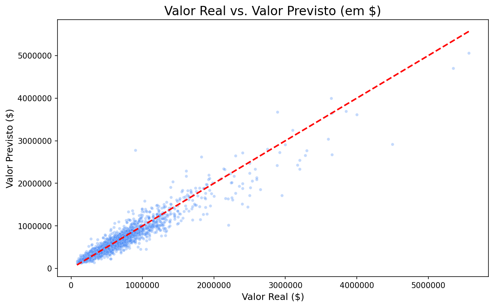
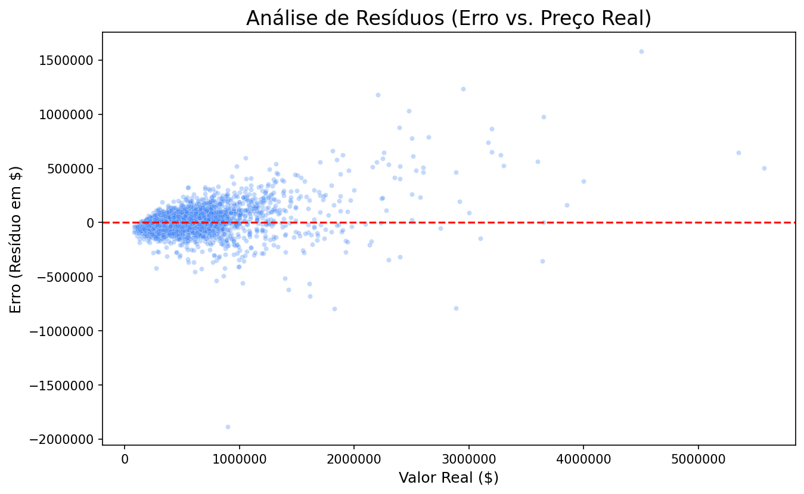
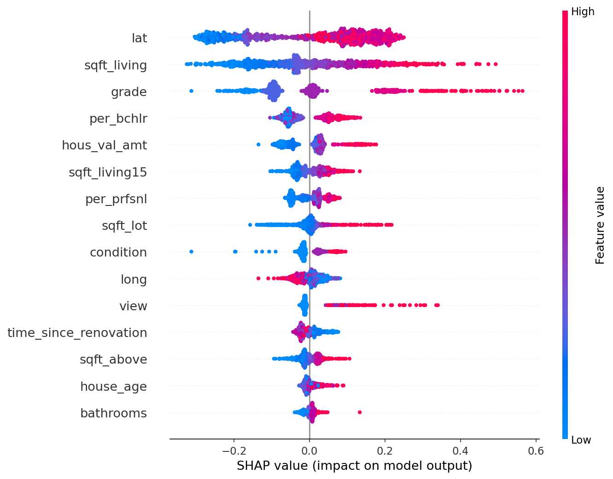

# Relatório Técnico: EDA e Modelagem

Este documento detalha meu processo técnico para os Entregáveis 1 (Análise de Dados) e 2 (Desenvolvimento do Modelo).

-----

## Relatório Técnico: EDA e Modelagem

### Análise Exploratória de Dados (EDA)

> O objetivo desta seção foi compreender a estrutura dos dados, verificar a qualidade e o formato das variáveis, e identificar a distribuição e a correlação das *features* com o preço da casa (`price`).

### **Visão Geral e Qualidade dos Dados**

* **Estrutura dos Dados:** Os dados foram carregados de `kc_house_data.csv` (21.613 linhas, 21 colunas) e `zipcode_demographics.csv` (70 linhas, 27 colunas).
* **Missing Data:** Não foram encontrados **valores ausentes** (*NaNs*) em nenhum dos *datasets* após a carga inicial.
* **Tratamento de Dados:**
    * A coluna `date` em `kc_house_data` foi corretamente convertida do tipo `object` para o tipo `datetime64[ns]` para permitir análises temporais.
    * Os dois *datasets* foram unidos usando uma **operação *left merge*** na coluna `zipcode` para enriquecer os dados das vendas de imóveis com as informações demográficas do CEP correspondente, garantindo a retenção de **todas** as 21.613 transações imobiliárias.

### **Análise da Variável-Alvo (`price`)**

* **Distribuição Bruta:** A distribuição original da variável-alvo (`price`) apresentava forte **assimetria positiva** (enviesada para a direita), com a maior parte das casas concentrada em preços mais baixos e uma cauda longa de *outliers* de alto valor .
* **Transformação Logarítmica:** Para estabilizar a variância e mitigar a influência de *outliers* em um modelo linear ou de árvore, o logaritmo natural (`np.log1p`) foi aplicado à variável `price`, criando a nova variável `log_price`.
    * A distribuição de `log_price` ficou **mais próxima de uma distribuição normal**, tornando-a um alvo mais adequado para a modelagem .

### **Correlação com `log_price` (Importância das Variáveis)**

A análise da matriz de correlação (`kc_house_data.corr(numeric_only=True)`) confirmou as principais variáveis preditoras para o preço:

| Métrica | Correlação com `log_price` |
| :--- | :--- |
| `price` | **0.891654** |
| `grade` | **0.703634** |
| `sqft_living` | **0.695341** |
| `hous_val_amt` | **0.630819** |
| `sqft_living15` | **0.619312** |

* **Principais Preditores:** `grade` (Qualidade de Construção/Design) e `sqft_living` (Área Habitável) são os preditores mais fortes, seguidos por `hous_val_amt` (Valor Mediano da Casa no CEP) e `sqft_living15` (Área de Moradia para os 15 vizinhos mais próximos).
* **Variáveis Demográficas:** Variáveis demográficas como `hous_val_amt`, `medn_incm_per_prsn_amt` (Renda Mediana Per Capita) e porcentagens de educação superior (`per_bchlr`, `per_prfsnl`) mostraram **correlações positivas e significativas** (acima de 0.55), indicando que a riqueza e o nível de escolaridade do código postal são fortes indicadores do preço do imóvel.

## Desenvolvimento do Modelo (ML)

### a. Feature Engineering e Generalização

O *feature engineering* foi focado em criar variáveis seguras (sem *data leakage*), como `house_age` e `time_since_renovation`. Para garantir a generalização, segui um processo rigoroso:

1.  **Split Limpo:** Os dados foram divididos em `train_processed.csv` (80%) e `test_processed.csv` (20%) **antes** de qualquer treinamento.
2.  **Validação Cruzada (Tuning):** Usei `RandomizedSearchCV(cv=5)` **apenas** no conjunto de treino (80%) para encontrar os melhores hiperparâmetros para o XGBoost.
3.  **Teste Isolado:** O conjunto de teste (20%) foi usado **uma única vez**, no final, para gerar as métricas de performance finais e imparciais.

### b. Performance Final (XGBoost)

O modelo final (`model.joblib`) foi avaliado no conjunto de teste isolado.

**Execute `python src/visualization/generate_report_plots.py` para preencher esta tabela:**

| Métrica | Valor (em Dólares) | Descrição |
| :--- | :--- | :--- |
| **R²** | ** 0.91 ** | Qualidade do Ajuste (0 a 1): Representa a porcentagem da variação do preço que o modelo consegue explicar. |
| **MAE** | ** R$ 64,739.02 ** | Erro em Valor Absoluto (Fácil para Negócio): É o erro médio do modelo em Dólares.  |
| **RMSE** | ** R$ 116,672.45 ** | Sensibilidade a Grandes Erros: Similar ao MAE, mas penaliza mais fortemente os erros grandes (outliers). |
| **MAPE** | ** 11.74% ** | Erro Percentual Médio: Representa a margem de erro relativa do modelo. |

-----

### c. Análise de Performance (Diagnóstico do Modelo)

Gerei os gráficos abaixo para diagnosticar o comportamento do modelo no conjunto de teste, provando sua robustez:

#### Análise de Erros (Previsto vs. Real)

  * **Análise:** Meu modelo segue a tendência central muito bem, o que prova a **precisão**. A maior parte das predições está agrupada densamente ao longo da linha de predição perfeita.

#### Análise de Resíduos (Diagnóstico Técnico)

Este gráfico é o diagnóstico técnico mais importante, revelando um padrão claro, o erro *absoluto* do meu modelo é maior para casas mais caras.

  * **Conclusão:** Isso é um comportamento esperado. O modelo é muito confiável para o *bulk* do mercado (abaixo de $2M), mas a margem de erro (em dólares) aumenta para o segmento de ultra-luxo.

-----

### d. Interpretabilidade do Modelo (SHAP)

Eu usei SHAP para entender *por que* o modelo toma suas decisões.

#### Importância Geral das Features

O gráfico de *summary plot* confirma que minhas hipóteses de EDA estavam corretas. `grade` (Qualidade) e `sqft_living` (Tamanho) são os preditores mais importantes, seguidos de perto pela localização (`lat`, `long`, `Mean_Income`).

